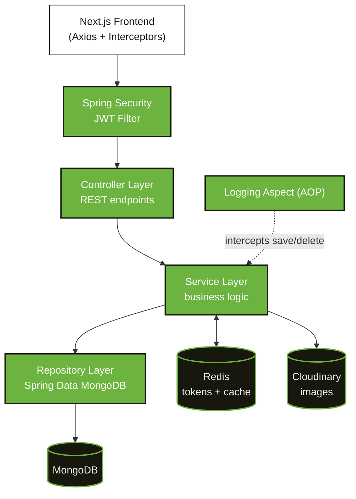
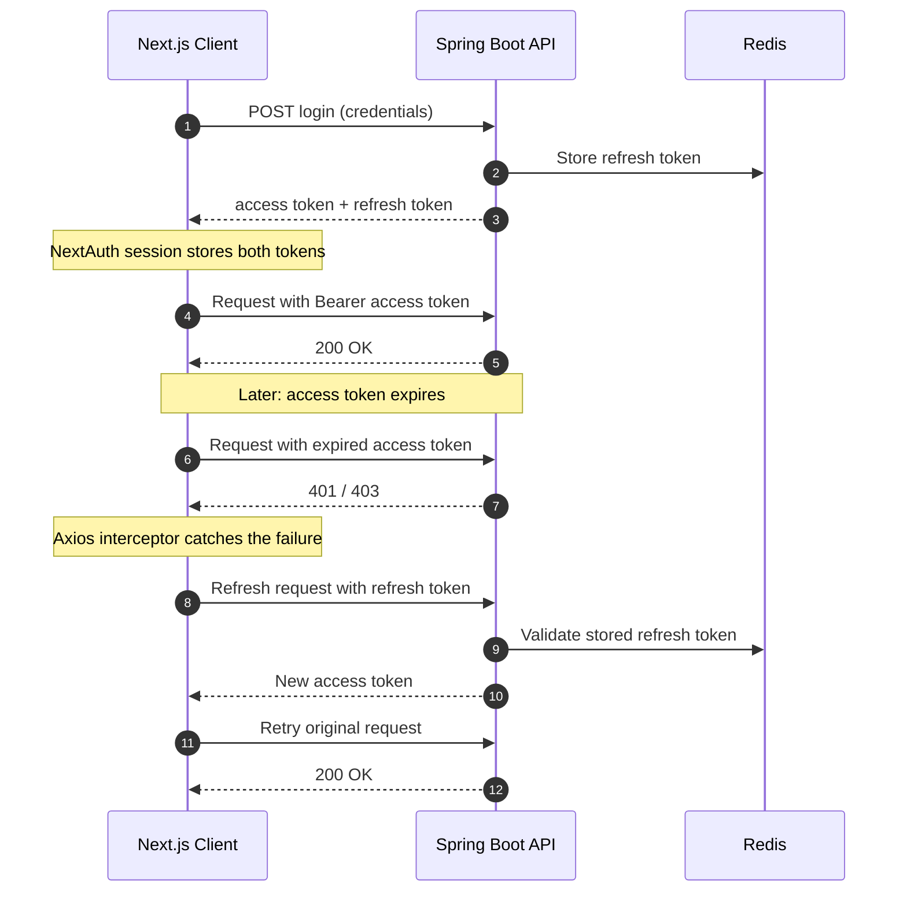
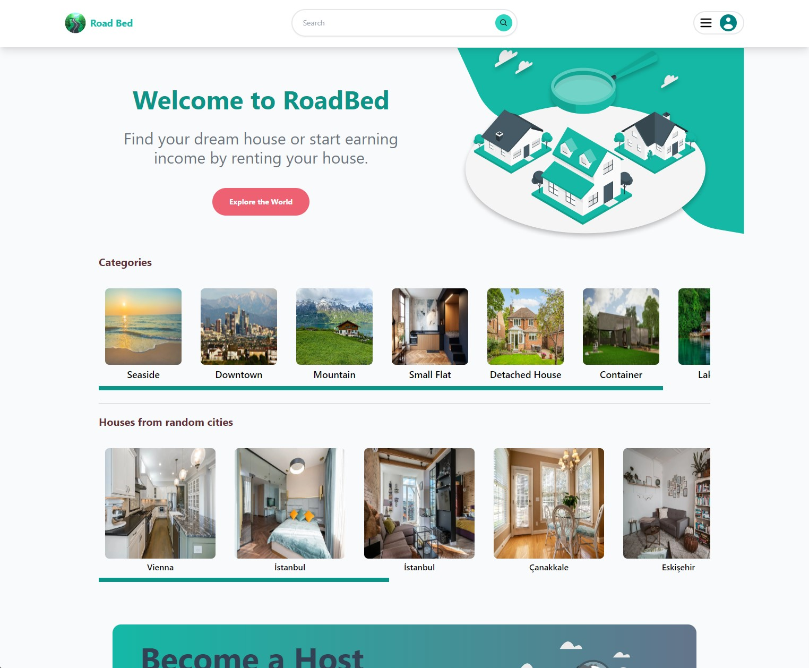
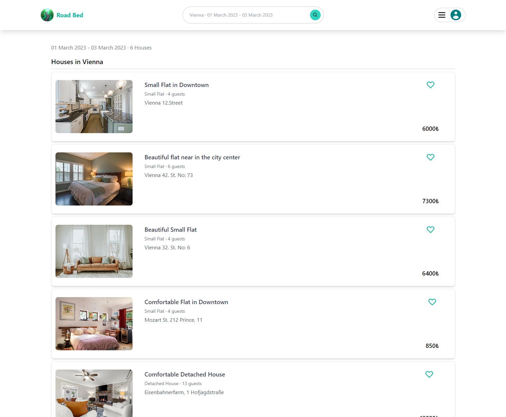
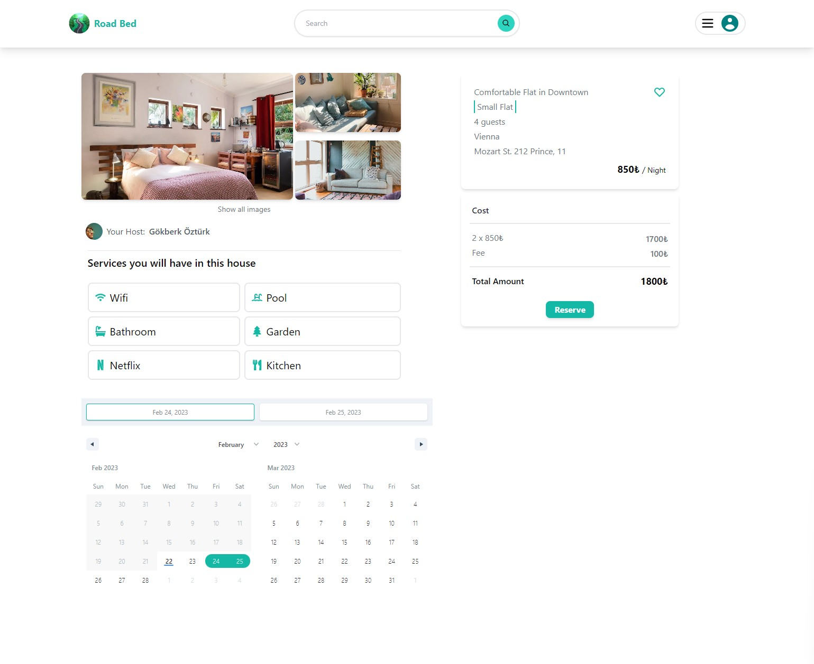
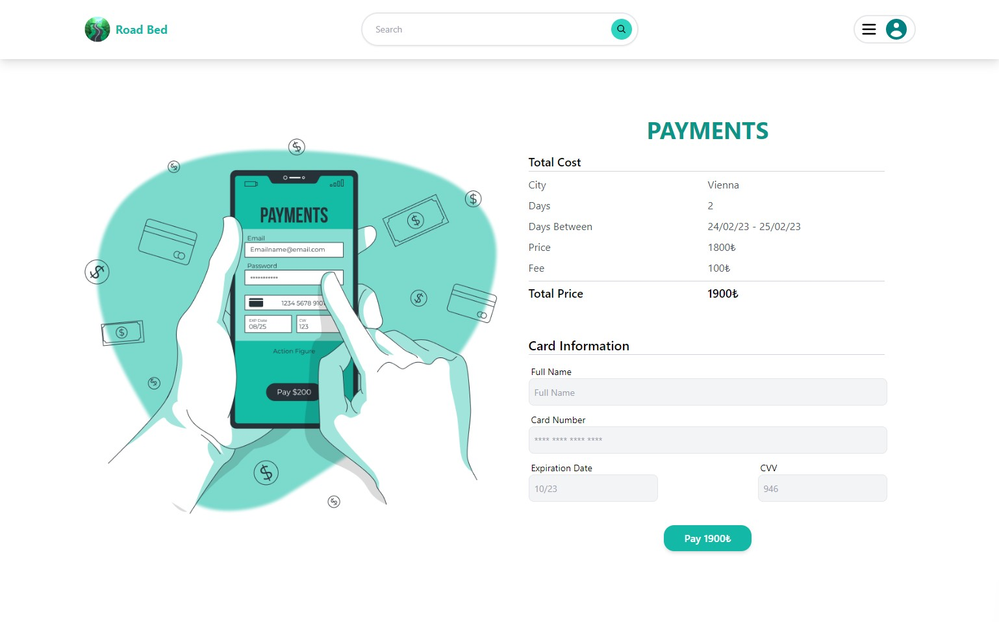
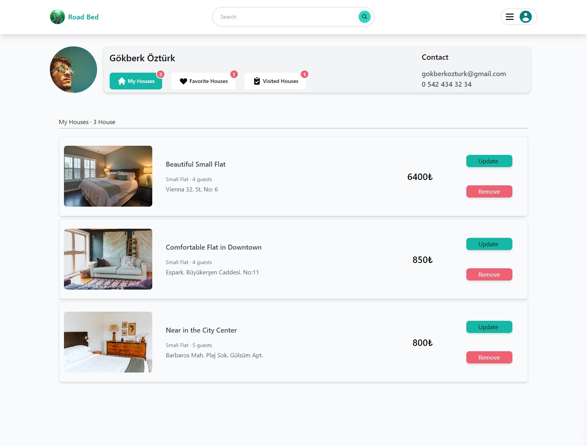

# 🏠 Roady - Book a Stay, Host a Home

> A full-stack short-term rental platform where users can **search homes by city and dates, reserve them, pay, and list their own properties to earn income**, built on a **Spring Boot 3 REST API** with **JWT + Redis-backed refresh tokens** and a **server-side rendered Next.js** frontend.

<p align="center">
  
  
  
  
  
  
  
  
</p>

---

## Table of Contents

- [Why This Project Stands Out](#-why-this-project-stands-out)
- [Features at a Glance](#-features-at-a-glance)
- [Tech Stack](#-tech-stack)
- [Quick Start](#-quick-start)
- [Architecture Deep-Dive](#-architecture-deep-dive)
  - [N-Layered Backend](#n-layered-backend)
  - [Authentication & Token Refresh Flow](#authentication--token-refresh-flow)
  - [Redis: Token Store + Cache](#redis-token-store--cache)
  - [Frontend State & Request Flow](#frontend-state--request-flow)
- [Features in Detail](#-features-in-detail)
- [Testing](#-testing)
- [Screenshots](#-screenshots)
- [Project Structure](#-project-structure)

---

## 🏆 Why This Project Stands Out

| Dimension                  | What It Does                                                                                                                   |
| -------------------------- | ------------------------------------------------------------------------------------------------------------------------------ |
| **Stateless Auth**         | Spring Security + JWT access tokens, with long-lived refresh tokens stored server-side in Redis so sessions can be revoked     |
| **Silent Token Refresh**   | An Axios response interceptor catches expired access tokens, fetches a new one with the refresh token, and retries the request |
| **Dual-Purpose Redis**     | One Redis instance serves as both the refresh-token store and a read-through cache for houses, categories, and cities          |
| **Clean Layering**         | N-layered architecture (Controller → Service → Repository) keeps business logic testable and isolated from persistence         |
| **Cross-Cutting Concerns** | Spring AOP logging aspect records save/delete operations without polluting business code                                       |
| **Cloud Media**            | Property and profile images are uploaded to Cloudinary, so the app server stays free of file storage                           |
| **One-Command Infra**      | MongoDB and Redis spin up together with a single `docker compose up -d`                                                        |

---

## ✨ Features at a Glance

| Feature           | Description                                                          |
| ----------------- | -------------------------------------------------------------------- |
| **Search**        | Find homes by city and date range                                    |
| **Filters**       | Browse by category (e.g. small flats) or city                        |
| **House Details** | Images, price, available dates, landlord name, and in-house services |
| **Reservations**  | Pick a date range on the detail page and reserve instantly           |
| **Payments**      | Checkout page that computes the total price for the selected stay    |
| **Host a Home**   | List your own property with images and details to earn income        |
| **Favourites**    | Save homes to a personal favourites list                             |
| **Profile**       | View favourite, visited, and owned houses; upload a profile picture  |
| **Auth**          | Register / login with JWT access + refresh tokens                    |

---

## 🛠 Tech Stack

### Backend

| Technology              | Why                                                       |
| ----------------------- | --------------------------------------------------------- |
| **Java 17**             | Modern LTS with records, text blocks, and improved switch |
| **Spring Boot 3**       | REST API with auto-configuration and embedded server      |
| **Spring Security**     | Authentication and route-level authorization              |
| **JWT**                 | Stateless access tokens + refresh tokens                  |
| **Spring Data MongoDB** | Repository abstraction over the data access layer         |
| **MongoDB**             | Flexible document model for listings with nested details  |
| **Redis**               | Refresh-token store and caching layer                     |
| **Spring AOP**          | Logging aspect for save / delete operations               |
| **Cloudinary**          | Cloud image upload and hosting                            |
| **Mockito + JUnit**     | Service-layer unit tests                                  |
| **Docker Compose**      | Runs MongoDB and Redis locally                            |
| **Maven**               | Build and dependency management                           |

### Frontend

| Technology               | Why                                                   |
| ------------------------ | ----------------------------------------------------- |
| **Next.js**              | Server-side rendering for listing pages               |
| **NextAuth**             | Session storage holding the access and refresh tokens |
| **Redux**                | Global store for reservation details                  |
| **Axios + Interceptors** | Auth header injection and automatic token refresh     |
| **React Date Range**     | Date-range selection for search and reservation       |
| **React Hook Form**      | Form handling and validation                          |
| **React Hot Toast**      | Notifications                                         |
| **Tailwind CSS**         | Responsive UI                                         |

---

## Quick Start

### Prerequisites

- **Java** 17+
- **Node.js** ≥ 18.x and **npm** ≥ 9.x
- **Docker** (for MongoDB and Redis)
- A **Cloudinary** account (for image uploads)

### 1. Clone the repository

```bash
git clone https://github.com/DestinyDriver/Roady.git
cd Roady
```

### 2. Configure environment

Create a `.env` file in the project root with your Cloudinary URL:

```
CLOUDINARY_URL=cloudinary://<api_key>:<api_secret>@<cloud_name>
```

### 3. Start MongoDB and Redis

```bash
docker compose up -d
```

### 4. Run the backend

```bash
./mvnw spring-boot:run
```

(or run the main class from your IDE)

### 5. Run the frontend

```bash
cd src/main/road-bed-frontend
npm install
npm run dev
```

Open [http://localhost:3000](http://localhost:3000) in your browser.

---

## Architecture Deep-Dive

### N-Layered Backend

Each layer depends only on the one below it, so services can be unit-tested with mocked repositories.



### Authentication & Token Refresh Flow



**Key design decisions:**

- **Refresh tokens live in Redis**, not only on the client. This makes them revocable, so logging out invalidates the session server-side.
- **Access tokens stay short-lived**, which limits the damage if one leaks.
- **The retry is transparent**: users never see an expired-session error mid-flow.

### Redis: Token Store + Cache

| Purpose         | What's stored              | Benefit                                             |
| --------------- | -------------------------- | --------------------------------------------------- |
| **Token store** | Refresh tokens per user    | Server-side session control and revocation          |
| **Cache**       | Houses, categories, cities | Frequently read data served without hitting MongoDB |

Cache and Redis configuration lives in the `config` package.

### Frontend State & Request Flow

- **NextAuth session** holds the JWT pair, so any component can read the access token.
- **Redux** holds reservation details (house, dates, total) between the detail page and the payment page.
- **Axios request interceptor** attaches `Authorization: Bearer <token>` to every call.
- **Axios response interceptor** handles expired tokens and retries automatically.

---

## Features in Detail

### 1. Search & Filters

- Search homes by **city** and **date range** (React Date Range)
- Filter by **category** or **city** from the home page
- House, category, and city lists are served from the **Redis cache**

### 2. House Detail & Reservation

- Image gallery, nightly price, landlord name, and in-house services
- Available dates shown for booking
- Select a date range and proceed to payment; the selection is kept in **Redux**

### 3. Payment

- Total price computed from the selected stay
- Credit card form built with **React Hook Form** validation

### 4. Host a Home

- Create page to list a property with details and multiple images
- Images uploaded to **Cloudinary** through the backend `ImageService`

### 5. Profile

- Favourite, visited, and owned houses in one place
- Optional profile picture upload

---

## Testing

Business-layer unit tests are written with **JUnit + Mockito**, mocking repositories so services are tested in isolation.

```bash
./mvnw test
```

Tests live in `src/test`.

---

## 📸 Screenshots

### Home Page



### Search Results



### House Detail



### Payment



### Profile



---

## Project Structure

```
Roady/
├── app_images/                    # Screenshots used in this README
├── data/                          # Seed / sample data
├── src/
│   ├── main/
│   │   ├── java/...               # Spring Boot app
│   │   │   ├── config/            # Redis, Cloudinary, security configuration
│   │   │   ├── controller/        # REST controllers
│   │   │   ├── service/           # Business logic + ImageService
│   │   │   ├── repository/        # Spring Data MongoDB repositories
│   │   │   └── aspect/            # AOP logging aspect
│   │   ├── resources/             # application properties
│   │   └── road-bed-frontend/     # Next.js frontend
│   └── test/                      # JUnit + Mockito unit tests
├── docker-compose.yml             # MongoDB + Redis
├── pom.xml                        # Maven build
└── mvnw / mvnw.cmd                # Maven wrapper
```
